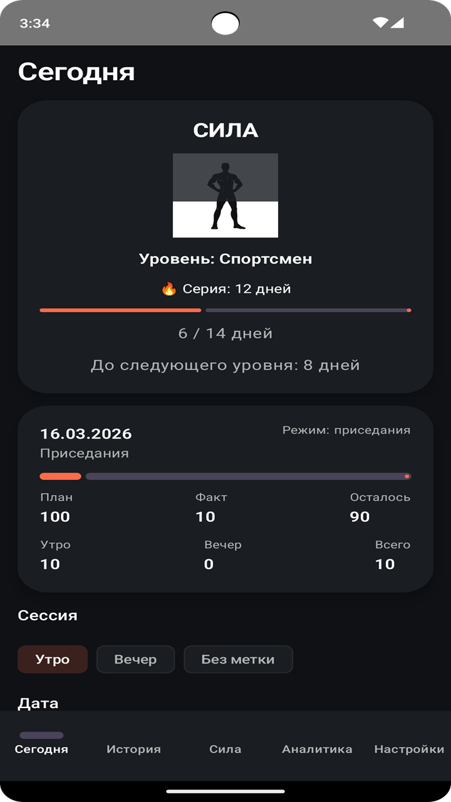
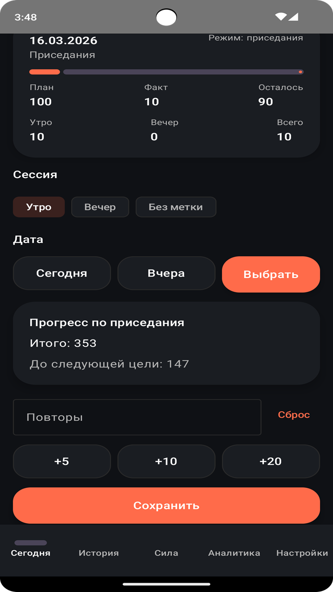
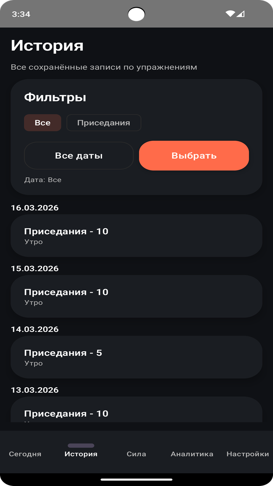
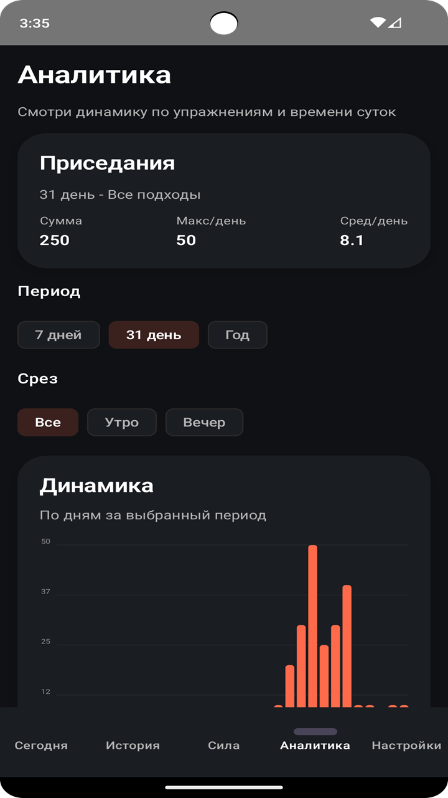
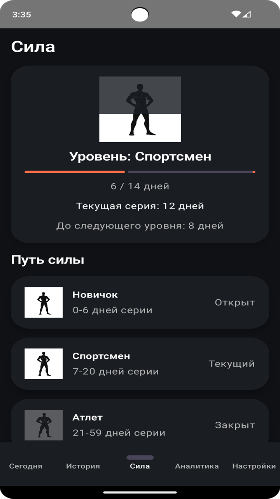
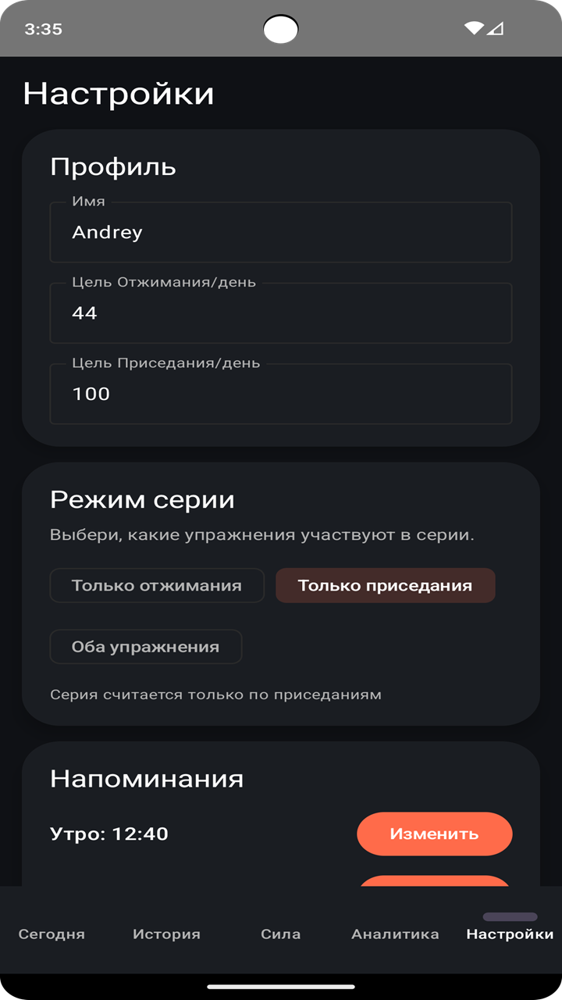

# Push-ups & Squats Tracker

Простое и удобное Android-приложение для отслеживания отжиманий и приседаний: цели на день, история тренировок, аналитика и напоминания.

> Pet-project / vibe-coding: от идеи и первых экранов до релиза и публикации в RuStore.

---

# Возможности

• Учёт отжиманий и приседаний по датам (включая прошлые дни)  
• Цели на день для каждого упражнения  
• Серия дней (streak)

### История тренировок
- редактирование и удаление записей
- фильтр по упражнению и дате
- визуальное разделение по дням

### Аналитика
- статистика за 7 дней
- статистика за 31 день
- годовая аналитика
- фильтр утро / вечер / всё

### Напоминания
- настройка времени утром и вечером
- подсказка о разрешении «Будильники и напоминания»

### Данные
- локальное хранение
- данные остаются на устройстве пользователя

---

# Скриншоты

  
  
  

  
  

  

---

# Технологии

- Kotlin
- Jetpack Compose (Material 3)
- Room Database
- WorkManager (напоминания)
- ViewModel + StateFlow

---

# Установка

1. Клонировать репозиторий
2. Открыть в Android Studio
3. Запустить приложение

Минимальная версия Android: **8.0**

---

# Статус проекта

Приложение опубликовано в **RuStore**.

Планируются небольшие улучшения интерфейса и функциональности.

---

Designed, built and published by a single developer.