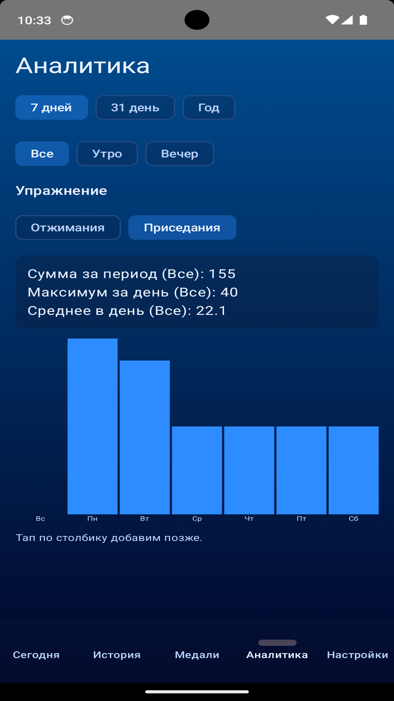
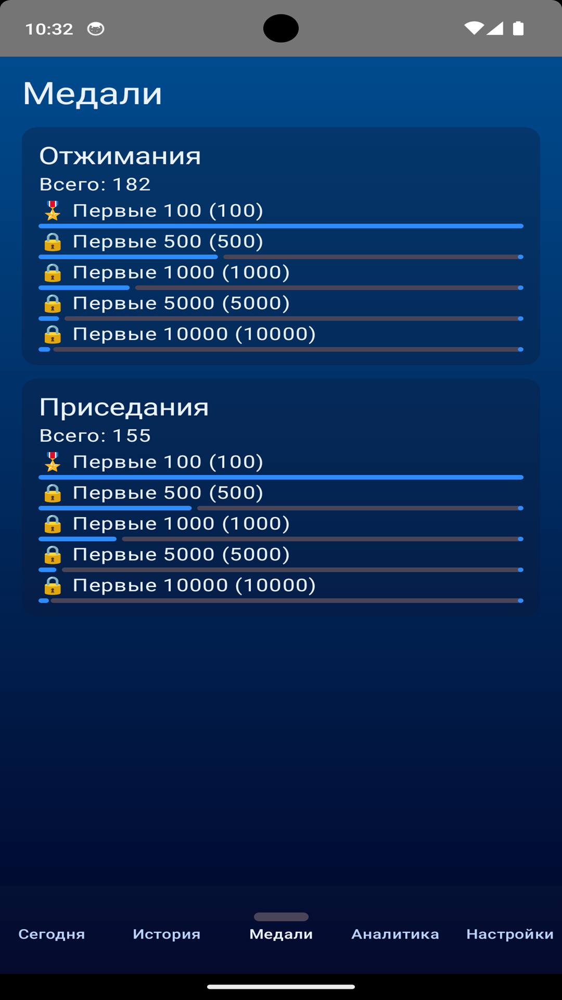

# Push-ups & Squats Tracker

Простое Android-приложение для отслеживания отжиманий и приседаний с целями на день, серией (streak), аналитикой и напоминаниями.

## Ссылка на RuStore
🔗 **RuStore:** https://www.rustore.ru/catalog/app/com.andre.fitnesstracker

> Pet-project / vibe-coding: от идеи и первых экранов до релиза и публикации в RuStore.

## Возможности
- Учёт отжиманий и приседаний по датам (включая прошлые дни)
- Цели на день для каждого упражнения
- Серия дней (streak) по выполненным дням
- История записей
- Аналитика по периодам
- Напоминания утром и вечером
- Локальное хранение данных

## Скриншоты

  
  
  

  
  
  

  

## Технологии
- Kotlin
- Jetpack Compose (Material 3)
- Room
- WorkManager (напоминания)
- ViewModel + StateFlow

## Установка
- Сборка: Android Studio
- Минимальная версия Android: 8

## Статус
Приложение опубликовано в RuStore. Дальнейшие улучшения — по мере необходимости.

> Designed, built and published by a single developer.
